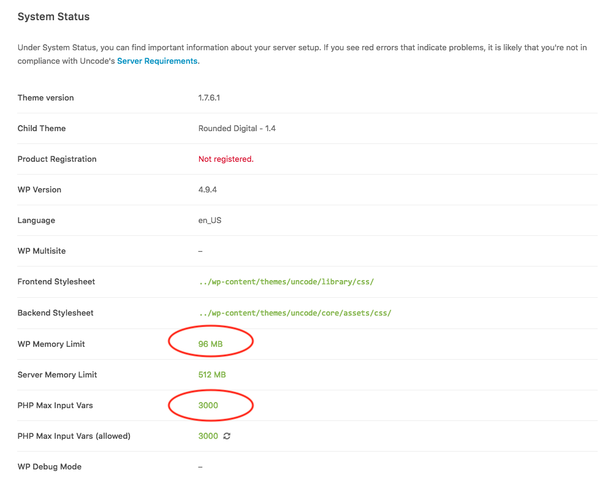

### Rounded Digital
  - #### System Status
- Check Settings

 - In Wordpress > wp-includes > default-constants.php
  - [ ] On line 42, change `WP_MEMORY_LIMIT` from `40M` to `96M`


 - Depending on the server configuration, one of these items needs to be performed

  - [ ] File Located: root > php > 7.0 > phprc

      ```
      upload_max_filesize = 200M
      post_max_size = 205M
      max_execution_time = 3000
      max_input_time = 5000
      memory_limit = 512M
      max_input_vars = 3000
      Allow_url_fopen = ON
  ```

  - [ ] Create `.user.ini` file in root directory of the Wordpress install
    - Add the following script to the beginning of the phprc file via FTP:

      ```
      upload_max_filesize = 200M
      post_max_size = 205M
      memory_limit = 128M
      max_input_vars = 3000
      allow_url_fopen = ON
  ```

  
